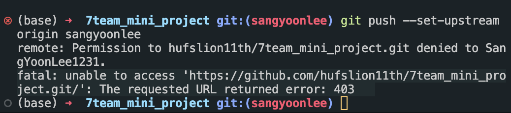

> 날짜 : 2023.05.17

 

## 🚨 문제 상황

- 팀 프로젝트를 위해 프로젝트용 레포지토리를 로컬 저장소에 연결하고 PR 시도를 해보았다.

- 로컬 저장소에서 파일 일부를 수정 후 원격 저장소로 push 해보니 다음과 같은 403 에러가 발생했다.

  

  

## 💡 문제 원인 및 해결 과정

### <strong>원인</strong>

- 구글링을 해보니 레포지토리에 대한 push 권한이 없어서 발생한 문제라 한다.

- PR을 요청할 때 기존 원격 레포지토리를 Fork하지 않고, origin을 기존의 원격 레포지토리 주소로 바로 연결해서 권한 문제가 생긴 것 같다.

 

### <strong>해결</strong>

- 기존 원격 레포지토리를 내 레포지토리로 Fork한 후, origin을 내 원격 래포지토리로, upstream을 기존 원격 레포지토리 연결했더니 문제게 해결되었다.ㄴ

  
