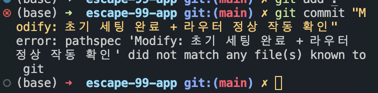

> 날짜 : 2023.05.18

 

## 🚨 문제 상황

- 갑자기 터미널에서 커밋을 하면 아래와 같은 에러가 발생했다.

  

- 특정 디렉토리에서만 에러가 발생하는 것이 아니라, 다른 디렉토리에서도 같은 문제가 발생했다.

  

## 💡 문제 원인 및 해결 과정

### <strong>원인</strong>

- 깃 커밋 시 명령어를 잘못 적었다..

  `git commit "Modify: 초기 세팅 완료"` (중간에 `-m`을 빠뜨림)

 

- 보통 해당 에러는 로컬 저장소의 git과 remote 저장소의 git 정보가 동기화 되지 않아서, 새로 만들어진 remote 저장소 브랜치를 참조할 수 없기에 발생하는 에러라고 한다.

- 이럴 떈 보통 깃을 초기화하거나, `git fetch`를 하거나, 원격 브랜치를 업데이트(`git remote update`) 하는 방식으로 문제를 해결하면 된다고 한다.

 

### <strong>해결</strong>

- 깃 명령어를 수정해서 다시 적었더니 해결되었다.

  `git commit -m "Modify: 초기 세팅 완료"`

  
